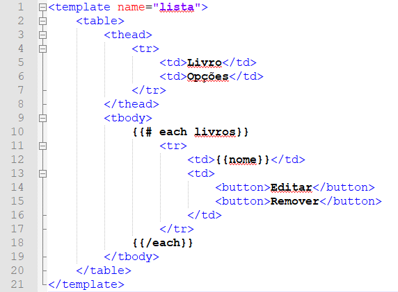

Olá terráqueos, no primeiro post sobre  Meteor, que você pode encontrar [aqui](https://hallessandro.github.io/programmi/introducao-meteor.html), vimos como construir uma aplicação Meteor de cadastro de livros. Atualmente a aplicação permite o cadastro de novos livros além de exibir os livros já existente. Nesse post vamos aprimorar essa aplicação, permitindo agora a edição e remoção dos livros presentes na lista. 

> Talvez você tenha notado que tanto neste post quanto na primeira parte, alguns códigos demonstrados são imagens, enquanto que outros são em blocos de código mesmo, isso ocorre haja vista que o Markdown não renderiza os códigos que estão entre chaves, como por exemplo {{>nome}}, por esse motivo todos os blocos de código que em alguma parte utilizem código entre chaves, estão sendo exibidos em forma de imagem. 

>Se você está começando daqui e não tem o projeto construido na primeira parte, você pode baixar o código [aqui](https://github.com/Hallessandro/meteor-post-parte1.git).

Para começar, vamos atualizar o template de lista, adicionando dois botões, um para editar e outro para remover. Além disso vamos atualizar a forma como os dados são apresentados de uma lista para uma tabela, apenas para deixar as coisas um pouco mais organizadas. 

 

Se você se lembra do primeiro post, para adicionar um novo livro a gente tratou o evento de submit do form em novo.js, fazendo com que ele resultasse na adição do novo livro. Vamos realizar esse mesmo tipo de tratamento para os nossos novos botões, começando pelo de remover, para isso altere o arquivo lista.js deixando o desta forma: 

```javascript
Template.lista.helpers({
	livros: function () {
		return Livros.find({});
	}
});

**A ideia aqui é causar erro mesmo, o código abaixo vai fazer com que ao clicar tanto em editar quanto em remover o registro seja deletado**

Template.lista.events({
    "click button" : function (e, template) {
            //Atualizar código
            e.preventDefault();
            let input = $("#livro");
            let nome = input.val();
            Livros.remove({nome: nome});
            input.val("");
    }
});
```

Teste a execução do código acima e veja o resultado, clique em ambos os botões. Se tudo ocorreu como deveria você deve ter notado que existe um comportamento nada desejado com nossos botões, tanto o de editar quanto o de remover estão removendo o registro, e definitivamente não é isso que desejamos. Isso ocorre pois estamos capturando o evento de "click button" ou seja, clique do botão, mas em nenhum momento falamos para o Meteor qual o botão, assim quando qualquer botão existente na página for clicado, ele vai disparar o evento. 

Para resolver isso vamos adicionar uma classe em cada um dos nossos botões: 

```html
	<button class="editar">Editar</button>
	<button class="remover">Remover</button>
```

Agora em lista.js ao invés de capturar apenas o evento de clique vamos capturar o evento de clique para o botão que possui a classe remover. Isso vai resolver o problema limitando que a ação só ocorra quando o botão possuir a classe correta.  

```javascript
Template.lista.events({
    "click button .remover" : function (e, template) {
            //Atualizar código
            e.preventDefault();
            let input = $("#livro");
            let nome = input.val();
            Livros.remove({nome: nome});
            input.val("");
    }
});
```

Agora vamos implementar o evento que vai responder ao botão de editar, para isso em lista.js adicione o código abaixo: 

```javascript
//Código anterior omitido 
"click button .editar" : function (e, template){
    let livro = this; 
    Livros.findOne({
        _id: livro._id; 
    });
    Livros.update({_id : livro._id},{$set:{nome:livro.nome}});
}
```
>O findOne() utilizado, retorna apenas um documento que satisfaça a condição passada na consulta, por mais que haja outros resultados ele vai retornar apenas o primeiro, diferente do find() que pode retornar vários resultados, dependendo das condições passadas na consulta. 

**DAR MAIS DETALHES DA IMPLEMENTAÇÃO DO METODO DE EDITAR**


**Referências:**

1. [Site oficial](https://www.meteor.com/)
2. [Build A Meteor.js App In 45 Minutes](https://www.youtube.com/watch?v=9494-2E4riQ)
3. [What Is Meteor?](https://www.youtube.com/watch?v=eOi3F6Kbl7E)
4. [Why use meteor](https://www.youtube.com/watch?v=6_8B3mi1m18)
5. [Meteor: Crie single page applications com JavaScript](https://www.alura.com.br/curso-online-meteorjs)
6. [Criando aplicações web real-time com JavaScript](https://www.casadocodigo.com.br/products/livro-meteor)