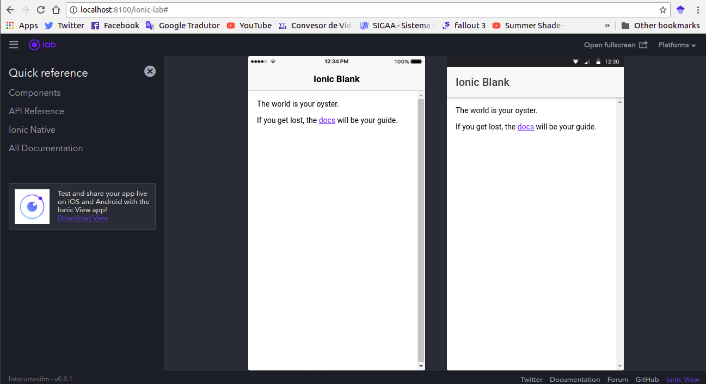

Olá terráqueos, neste primeiro post vamos ver como instalar e criar nossa primeira app utilizando o Ionic 3. O Ionic, caso você não conheça, é um framework para desenvolvimento de aplicações móveis híbridas, de forma rápida e de fácil aprendizado. 

**1. Configurando o ambiente** 

Para instalar o Ionic você vai precisar ter instalado o Node e o npm, você pode fazer isso baixando o Node [aqui](https://nodejs.org/en/). 

Se você está utilizando Linux, pode fazer a instalação por meio do apt-get, basta executar os comandos abaixo: 

```
sudo apt-get update
sudo apt-get install nodejs
sudo apt-get install npm
```

Se quiser, você também pode ver um tutorial mais completo da instalação dessas ferramentas, nesse link [aqui](https://www.digitalocean.com/community/tutorials/como-instalar-o-node-js-no-ubuntu-16-04-pt), é um tutorial da DigitalOcean, bastante detalhado e com outras opções de download além do apt. 

Depois de instalado o Node e o npm você vai precisar instalar o Ionic CLI e o Cordova, para isso execute o comando abaixo: 

```
npm install -g ionic cordova
```
>O -g presente no comando, indica que essa vai ser uma instalação global, por isso é necessário adicionar sudo ao comando, caso esteja no Linux ou Mac, ou abrir o cmd como administrador caso esteja no Windows.

Pronto, se você conseguiu instalar tudo o que precisa, agora você está pronto para criar sua primeira app com Ionic e é isso que vamos fazer no tópico 2. :-D 

**2. Criando nossa primeira app**

O Ionic por padrão já possui alguns templates que podemos usar para criar nosso projeto, vamos usar o blank que é o mais simples, mas caso tenha interesse, [aqui](https://ionicframework.com/docs/cli/starters.html) você pode encontrar mais detalhes de todos os templates disponíveis. 

Para criar o projeto, execute o comando abaixo: 
```
ionic start nome_app blank
```
Troque nome_app pelo nome que deseja dar a sua app, vou chamar a minha de guiacursosifrn, pois ela vai listar todos os cursos disponíveis no Instituto Federal de Educação, Ciência e Tecnologia do RN.  

A lista dos cursos vai ser obtida por meio do link abaixo: 

>[Lista de cursos do IFRN](https://dados.ifrn.edu.br/dataset/7b48f9d0-205d-46b1-8225-a3cc7d3973ff/resource/fe0e9d2c-1c02-4625-b692-13edcc3380ae/download/dados_extraidos_recursos_cursos-ofertados.json)

Se você acessou o link acima, deve ter visto que ele apresenta uma lista gigante de dados em formato JSON, não se preocupe com isso, vamos ver como ler esses dados e filtrar conforme nossa necessidade. 

Agora que você já criou sua app, é bem provável que você deseje ver como ela está no momento, para isso execute o comando abaixo: 

```
ionic serve --lab
```

Ao fim da execução uma janela do seu navegador padrão será aberta, por padrão no meu caso, a janela exibiu a versão de iOS, mas caso queira ver a versão de Android ou as duas ao mesmo tempo, você deve acessar o menu Plataforms, e marcar às caixas dos sistemas que deseja ver, marcando iOS e Android você deve estar vendo algo como o da imagem abaixo: 

 

Chegamos ao fim dessa primeira parte, vimos ai que com alguns comandos conseguimos instalar o Ionic e criar nossa primeira app. No próximo post vamos ver como melhorar essa nossa primeira tela, que está bem sem graça atualmente, sendo assim, até próxima pessoal. 