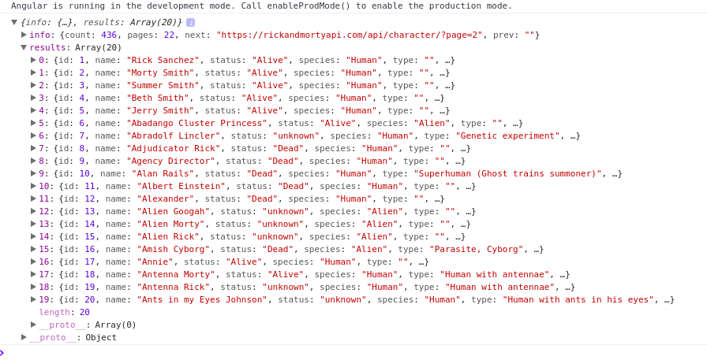

Desde da versão 4.3 o Angular introduziu um novo móudlo HTTP, o HttpClient. Disponível no pacote @angular/common/httt, esse novo módulo é uma reformulação completa do antigo HttpModule, e nesse post vamos ver como consumir uma API utilizando esse carinha. 


Antes de tudo é necessário criar um novo projeto, para isso digite o comando abaixo no terminal, trocando rickMortyClient pelo nome que você deseja dar ao seu projeto (Em breve você vai entender o motivo do meu ter esse nome). 
```
ng new rickMortyClient
```
Ao final da execução um diretório com o nome do projeto foi criado, abra esse diretório no seu editor de texto preferido e em seguida abra o arquivo app.module.ts. 

Para que seja possível utilizar o HttpClient é necessário importar o módulo como é mostrado no código abaixo:

```typescript
import { BrowserModule } from '@angular/platform-browser';
import { NgModule } from '@angular/core';
import { HttpClientModule } from '@angular/common/http'; //
import { AppComponent } from './app.component';

@NgModule({
  declarations: [
    AppComponent
  ],
  imports: [
    BrowserModule,
    HttpClientModule
  ],
  providers: [],
  bootstrap: [AppComponent]
})
export class AppModule { }

```

Depois de importado agora podemos utilizar o HttpClient em nossos componentes, para isso é necessário injetar o HttpClient no constructor, algo como o que pode ser visto abaixo: 
```typescript
import { Component } from '@angular/core';
import { HttpClient } from '@angular/common/http';

@Component({
  selector: 'app-root',
  templateUrl: './app.component.html',
  styleUrls: ['./app.component.css']
})
export class AppComponent {
  title = 'app';

  constructor(private http: HttpClient){}
}
```
Agora que já temos tudo pronto, vamos começar criando um método que será utilizado para fazer uma requisição do tipo GET, vou chamar o meu método de getPersonagens(), fique a vontade para chamar do que quiser. 

Requisições do tipo GET são bastante simples, tudo o que você precisa fazer é implementar algo como o exibido abaixo: 

```typescript
  getPersonagens(){
    this.http.get("URL_ONDE_OS_DADOS_ESTAO")
      .subscribe(retorno => {
        //Tratamento que deseja dar ao retorno
      })
  }
```
Para esse exemplo vou utilizar uma API que disponibiliza a lista dos personagens de Rick and Morty, você pode encontrar tudo sobre a API inclusive outras opções além da lista de personagens, clicando [aqui](https://rickandmortyapi.com). Altere o código do método que você criou para algo como o apresentado abaixo: 
```typescript
  getPersonagens(){
    this.http.get("https://rickandmortyapi.com/api/character/")
      .subscribe(retorno => {
        console.log(retorno);
      })
  }
```
O código acima apenas vai exibir no console do seu navegador o retorno para a chamada do método, porém isso só vai acontecer se você adicionar alguma chamada a esse método, para facilitar as coisas vou adicionar uma chamada para ele no ngOnInit(), assim quando o componente for carregado o retorno vai ser exibido no console. 

Abaixo segue o código completo até o momento: 

```typescript
import { Component } from '@angular/core';
import { HttpClient } from '@angular/common/http';

@Component({
  selector: 'app-root',
  templateUrl: './app.component.html',
  styleUrls: ['./app.component.css']
})
export class AppComponent {
  title = 'app';

  ngOnInit(): void {
    this.getPersonagens();
  }
  constructor(private http: HttpClient){}

  getPersonagens(){
    this.http.get("https://rickandmortyapi.com/api/character/")
      .subscribe(retorno => {
        console.log(retorno);
      })
  }

}
```
Para iniciar nossa aplicação, no terminal acesse a pasta do projeto e execute o comando abaixo: 

```
ng serve
```
Depois de carregado acesse **http://localhost:4200/** no navegador, se tudo ocorreu como deveria você vai ver uma tela de boas vindas do Angular. Abra o console do navegador, no Chrome é só apertar F12. Se tudo deu certo, você vai ver algo como o exibido na imagem abaixo: 

 

O que vai interessar para gente é o que está dentro de result, dentro de info estão algumas informações como o toltal de personagens e a quantidade de páginas, para facilitar as coisas não vamos nos preocupar com as páginas nesse momento, vamos apenas requistar e exibir os dados da primeira página, essa do link que utilizamos. 

Agora que já conseguimos fazer uma requisição e vimos que os dados são exibidos no console, seria interessante exibir isso na nossa página ao invés daquela mensagem de boas vindas do Angular, ou seja, para cada personagem na resposta, vamos mostrar o nome, a foto e a situação dele, para isso vamos começar criando uma classe Personagem. 

Para manter as coisas organizadas, não vamos criar nossa classe solta por ai, vamos criar uma pasta chamada de dominio, dentro de src e nela vamos adicionar toda e qualquer classe de modelo, ou seja, classes que definem como os objetos são. 

```
mkdir src/dominio
touch src/dominio/Personagem.ts
``` 

Veja que chamei o arquivo de Personagem.ts, com P maiúsculo mesmo, isso é uma boa prática no mundo JS, é sempre bom criar com a letra inicial maiscúla arquivos que vão conter classes. O nome da classe também deve seguir esse padrão. 

```
class Personagem{
    constructor(){}
}
```

Beleza, já criamos a classe e tals, mas e agora? Essa classe só vai servir de algo se ela possuir algum atríbuto, então vamos adicionar alguns. 

Um pouco mais acima no texto eu falei que deveriamos mostrar o nome, situação e a foto do personagem e é isso que vamos fazer. Volte na saída do console e expanda algum dos objetos encontrados em results, Veja que dentre outras várias informações há os campos name, status e image, são esses caras que vamos utilizar.

```typescript
export class Personagem{   
    name: string;
    status: string;
    image: string;
    constructor(nome, status, image){
        this.name = name; 
        this.status = status;
        this.image = image; 
    }
}
```
Agora podemos tratar o retorno do nosso GET utilizando a classe Personagem. Se você se lembra bem o retorno não é de apenas um personagem mas sim de vários, então precisamos de uma lista de personagens, para isso no app.component.ts declare uma lista de personagens, algo como: 
```typescript
personagens: Personagem[] = [];
```
Para funcionar acho que nem preciso dizer que você vai precisar importar a classe personagem. :-D 

Agora dentro do nosso getPersonagens() vamos passar o retorno da requisição para nossa lista, mas antes vamos apenas adicionar um if para garantir de que temos algum retorno para passar para a lista, afinal não queremos que nada de errado.
```typescript
  getPersonagens(){
    this.http.get("https://rickandmortyapi.com/api/character/")
      .subscribe(retorno => {
        if(retorno.results){
          this.personagens = retorno.results;
        }else {
          this.personagens = [];
        }
      })
  }
```
Agora o que precisamos fazer é exibir nosso resultado na tela, para isso acesse app.component.html, remova tudo que há lá dentro e adicione o código abaixo: 
```html
<ul>
  <li *ngFor="let p of personagens">
    {{p.name}}
  </li>
</ul>

```
Repare no *ngFor dentro de li, esse carinha é uma diretiva do Angular para percorrer listas, funciona exatamente como um for em boa parte das linguages. Ao acessar no navegador, vamos ver algo como o apresentado na imagem abaixo: 

 

Já conseguimos obter as informações e exibir o nome dos personagens na tela, agora vamos exibir também a imagem e o status deles, até poderiamos fazer isso adicionando essas informações dentro da lista abaixo do nome, mas não seria a melhor das exibições, então vamos adiconar um pouco de mágica CSS para deixar as coisas mais bonitas. 

No app.componnet.html, adicione o código abaixo: 
```html
<ul id="lista-personagens">
  <li *ngFor="let p of personagens">
      <div class="card">
        
        <div class="container">
          <h4>
            <b>{{p.name}}</b>
          </h4>
          <p>{{p.status}}</p>
        </div>
      </div>
      <br>
  </li>
</ul>
```
Agora vamos ao CSS, para facilitar o alinhamento das coisas utilizei flexbox, que é uma mão na roda nesse quesito, se quiser mais informações você pode acessar um guia bem completo do assunto, clicando [aqui](https://css-tricks.com/snippets/css/a-guide-to-flexbox/). 

Dentro do arquivo app.component.css, adicione o código abaixo: 
```css
/* Isso remove o comportamento padrão da lista de add ponto
ou número nos itens da lista */
ul{
    list-style-type: none;
}

/* Aqui é onde usei flexbox para deixar tudo alinhado */
#lista-personagens {
    display: flex;
    justify-content: space-around;
    flex-wrap: wrap;
}

/* Abaixo são criados os efeitos de card */
.card {
    box-shadow: 0 4px 8px 0 rgba(0,0,0,0.2);
    transition: 0.3s;
}

.card:hover {
    box-shadow: 0 8px 16px 0 rgba(0,0,0,0.2);
}

.container {
    padding: 2px 16px;
}
```

Recarregue sua página e veja o resultado, se tudo ocorreu bem você vai ver uma tela como a apresentada abaixo: 

 

Então isso é tudo pessoal, vimos como fazer requisições GET utilizando o HttpClient e como exibir os dados recuperados na tela, qualquer dúvida fique a vontade em me mandar uma mensagem. :-D 

O código completo desse post você pode encontrar [aqui](https://github.com/Hallessandro/rickmortyangular). 

**Referências:**

1. [THE RICK AND MORTY API](https://rickandmortyapi.com)
2. [HttpClient](https://angular.io/guide/http)
3. [Angular 4.3 HttpClient (Accessing REST Web Services With Angular)](https://medium.com/codingthesmartway-com-blog/angular-4-3-httpclient-accessing-rest-web-services-with-angular-2305b8fd654b)